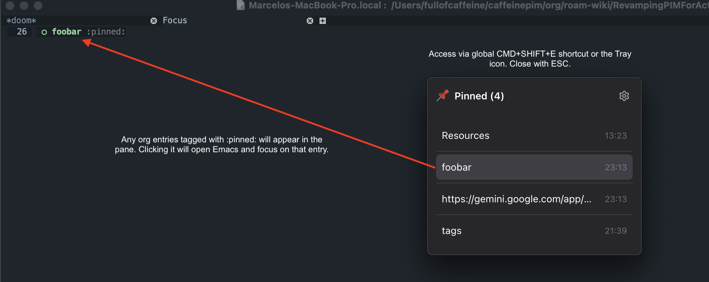

# EspressoBar

> Your org repo's focus area. A persistent workbench for what matters right now.

EspressoBar transforms pinned org-mode headlines into an always-ready tray application. Think of it as your **working memory** - a curated view of your current focus that persists across Emacs sessions and stays accessible from anywhere on your system.

EspressoBar also "guide-coded" with Cursor / Sonnet 4 from scratch. Minor manual edits here and there from me. It's still a WIP.



## Features

- **📌 Pin org headlines** with `:pinned:` tag and they appear in your tray
- **🚀 Quick access** - System tray popup shows your focus area instantly
- **📝 Rich details** - Click pins to see content, timestamps, tags, and file info
- **⚡ Jump to Emacs** - "Open in Emacs" button opens files at exact lines
- **💾 Persistent** - Your focus survives Emacs restarts and system reboots
- **🎯 Background scanning** - Automatically finds pinned items across org directories

## Quick Start

1. **Pin something** in your org files:
   ```org
   * TODO Review Q4 planning deck    :pinned:
   * NEXT Call Sarah about project timeline    :pinned:
   ```

2. **Start Emacs server** (add to your config):
   ```elisp
   (server-start)
   ```

3. **Install and run EspressoBar:**
   ```bash
   npm install
   npm start
   ```

4. **Scan your org directories** in EspressoBar preferences

5. **Access instantly** from the system tray - your focus area is always there

6. **Jump to context** with "Open in Emacs" to continue where you left off

## Emacs Integration

EspressoBar uses `emacsclient` for seamless file opening - no complex setup required!

### Setup

**1. Ensure Emacs server is running:**
```elisp
;; Add to your Emacs config (.emacs, init.el, or Doom's config.el)
(server-start)
```

**2. Verify your setup:**
```bash
# Test everything works
node tests/test-emacs-integration.js
```

This test will check if `emacsclient` is installed and if Emacs server is running.

### Installation by Platform

**macOS:**
```bash
brew install emacs  # Recommended
```

**Linux:**
```bash
sudo apt install emacs      # Ubuntu/Debian
sudo pacman -S emacs        # Arch
```

**Windows:**
```bash
choco install emacs         # Chocolatey
```

### Troubleshooting

**"emacsclient not found":**
- Install Emacs properly or ensure `emacsclient` is in your PATH
- Restart EspressoBar after installation

**"Emacs server is not running":**
- Run `M-x server-start` in Emacs
- Or add `(server-start)` to your Emacs config

**Still having issues?**
- Run the test script: `node tests/test-emacs-integration.js`
- Check that `emacsclient --version` works in your terminal

### How It Works

When you click "Open in Emacs" on a pin:
1. EspressoBar finds your `emacsclient` binary across platforms
2. Runs `emacsclient --no-wait +LINE:1 /path/to/file.org`
3. Emacs opens the file at the exact line of your org headline
4. If emacsclient fails, elisp code is copied to your clipboard as fallback

## Development

### Getting Started

```bash
npm install
npm start          # Development mode
npm run build      # Production build
npm run test:e2e   # End-to-end tests
```

### Release Management

EspressoBar uses automated semantic versioning with [semantic-release](https://github.com/semantic-release/semantic-release). Releases are automatically created based on commit messages following [Conventional Commits](https://conventionalcommits.org/).

**Commit Message Format:**
- `fix: description` → Patch release (1.0.0 → 1.0.1)
- `feat: description` → Minor release (1.0.0 → 1.1.0)
- `feat!: description` or `BREAKING CHANGE:` → Major release (1.0.0 → 2.0.0)

**Release Process:**
1. Make changes using conventional commit messages
2. Push to `main` branch or merge PR
3. GitHub Actions automatically:
   - Runs tests and builds for all platforms
   - Determines next version from commits
   - Generates changelog
   - Creates GitHub release with artifacts
   - Updates package.json version


### Tech Stack

- **Runtime**: Electron 28.x for cross-platform desktop app
- **UI**: React 18 + Tailwind CSS + shadcn/ui components
- **State**: Zustand for simple, focused state management
- **Build**: Vite for fast development and optimized builds
- **Config**: electron-store for persistent settings
- **Testing**: Playwright for comprehensive E2E tests

### Architecture

EspressoBar follows a secure Electron architecture:

- **Main Process**: Handles org file scanning, emacs integration, and system tray
- **Preload Script**: Secure IPC bridge using contextBridge (no node integration)
- **Renderer Process**: React app with strict security policies
- **Services**: Modular backend services for org parsing, file caching, and emacs communication

### Key Features Implemented

✅ **Org File Scanning** - Recursive directory scanning with smart caching  
✅ **Pin Detail View** - Rich content display with timestamps and metadata  
✅ **Emacs Integration** - Cross-platform emacsclient support with fallbacks  
✅ **Settings Persistence** - User preferences saved across sessions  
✅ **Background Operation** - Efficient scanning without blocking UI  
✅ **Test Coverage** - Comprehensive E2E test suite (30+ tests). No lower-level unit tests to keep things simple (might introduce if the app grows more complex in the future).

## Testing

### E2E Tests
```bash
npm run test:e2e              # Run all tests
npm run test:e2e:ui          # Interactive test runner  
```

### Integration Testing
```bash
node tests/test-emacs-integration.js  # Test emacs setup
```

## Philosophy

Your org system is your **external brain**. EspressoBar is your **working memory** - the small set of things you're actively thinking about. By keeping this separate but connected, you maintain focus without losing the bigger picture.

**Design Principles:**
- **Focused**: Show only what's pinned, not everything
- **Persistent**: Survives across sessions and context switches
- **Accessible**: Always available from system tray
- **Connected**: Seamless integration back to org files
- **Simple**: Minimal setup, maximum utility

## Contributing

1. Fork the repository
2. Create a feature branch
3. Add tests for new functionality
4. Ensure all E2E tests pass
5. **Use conventional commit messages** (see Release Management section)
6. Submit a pull request

**Important:** This project uses automated semantic versioning. Please follow [Conventional Commits](https://conventionalcommits.org/) format for your commit messages to ensure proper version bumping and changelog generation.

## License

GPL-3.0-or-later - see LICENSE file for details
